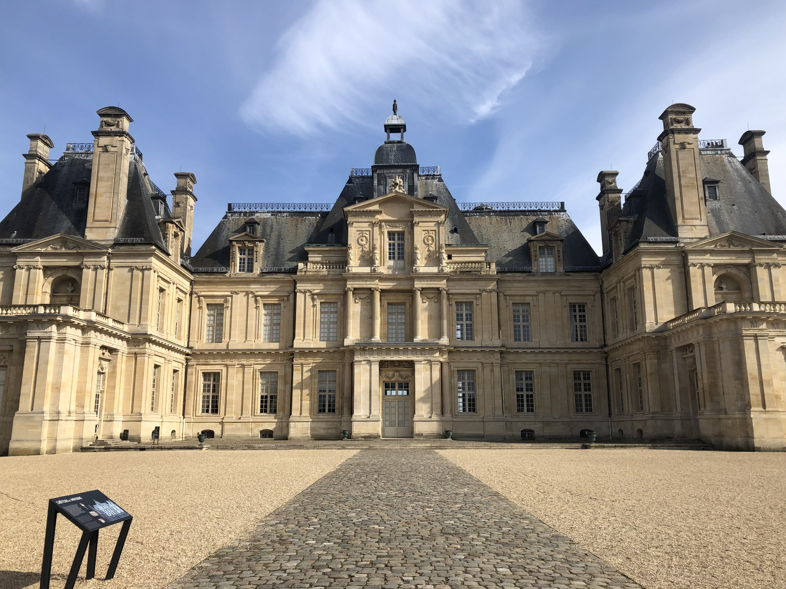
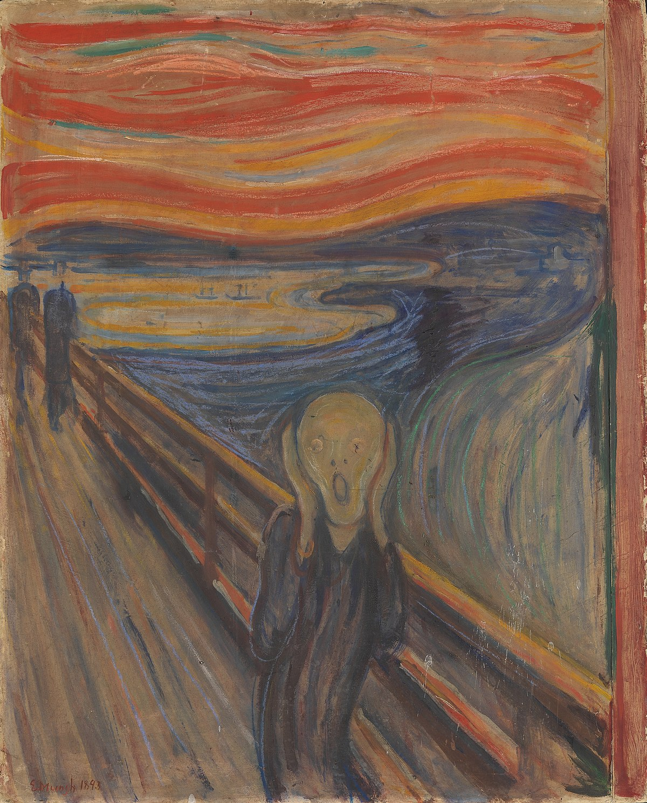
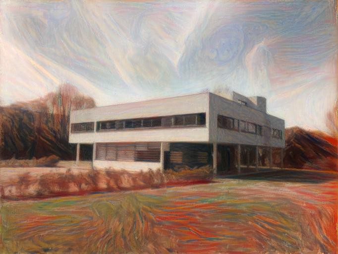
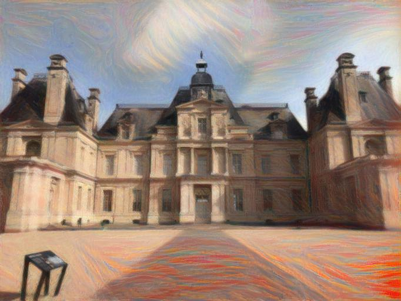
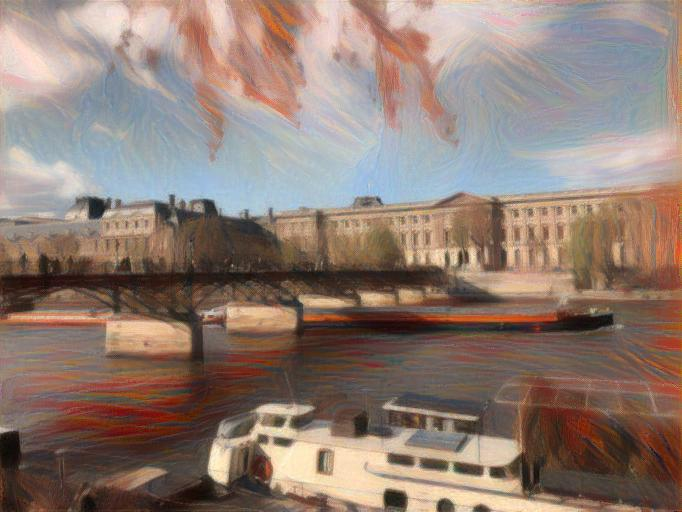
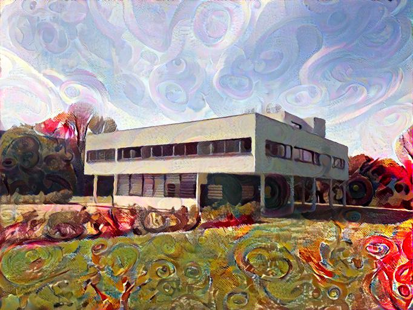
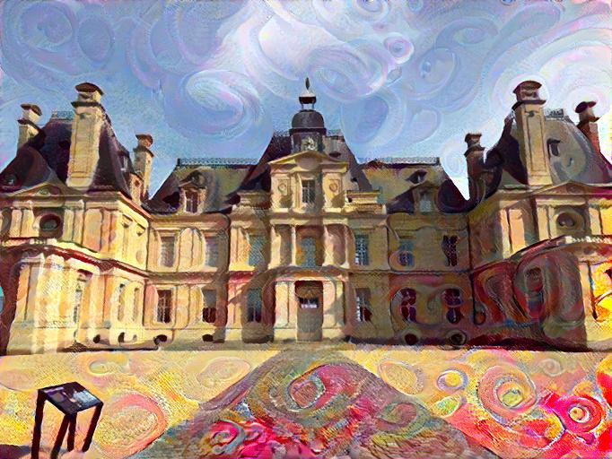
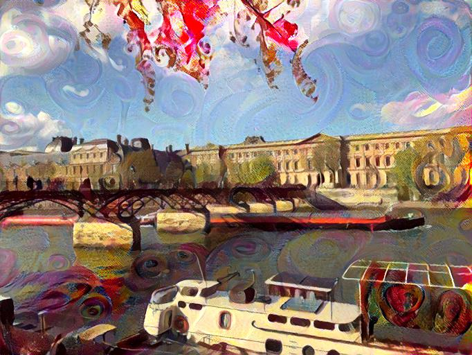

# Image Style Transfer

PyTorch implementation of [A Neural Algorithm of Artistic Style [1]](https://arxiv.org/abs/1508.06576) and [Perceptual Losses for Real-Time Style Transfer and Super-Resolution [2]](https://arxiv.org/abs/1603.08155).

[[1]](https://arxiv.org/abs/1508.06576) implemented in `conv_style_transfer.py` proposes an optimization technique that separates and recombines the content and style of arbitrary images using a perceptual loss. The perceptual loss is defined by the combination of a feature reconstruction loss as well as a style reconstruction loss from pre-trained layers of a VGG19 model.

[[2]](https://arxiv.org/abs/1603.08155) impemented in `style_train.py` trains an image transformation network to perform style transfer as opposed to optimizing along the manifold of images. For a given style image, the network is trained using the [MS-COCO dataset](https://cocodataset.org) to minimize the perceptual loss. The pre-trained model used in this implementation is VGG16.

## Requirements

- Python 3.7
- PyTorch 1.10.2
- Torchvision 0.11.3
- NumPy 1.21.5
- Pillow 9.0.1

## Basic Usage

### 1) Style Transfer Through Optimization

```bash
$ python conv_style_transfer.py --content <path_to_content_image> --style <path_to_style_image>
```

<section align='center'>
    
    
    
</section>

---

<section align='center'>
    
</section>

<section align='center'>
    
    
    
</section>

---

<section align='center'>
    
</section>

<section align='center'>
    
    
    
</section>

### 2) Image Transformation Training

```bash
$ python style_train.py --datadir <path_to_dataset> --style <path_to_style_image>
```
